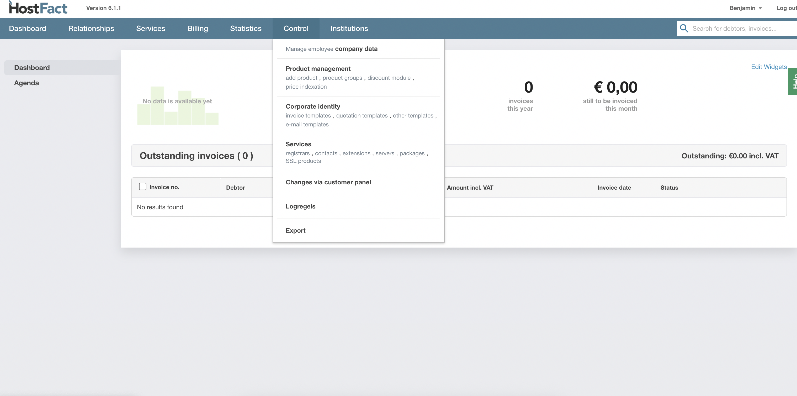
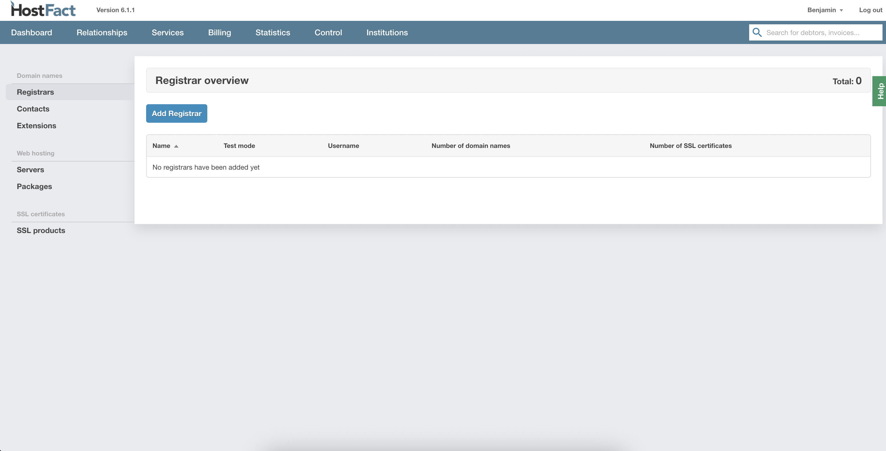
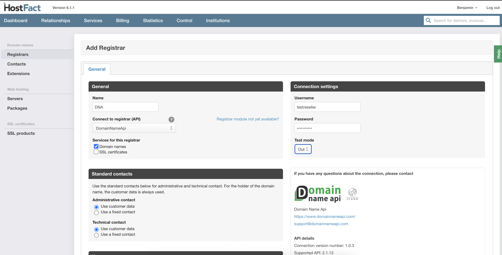
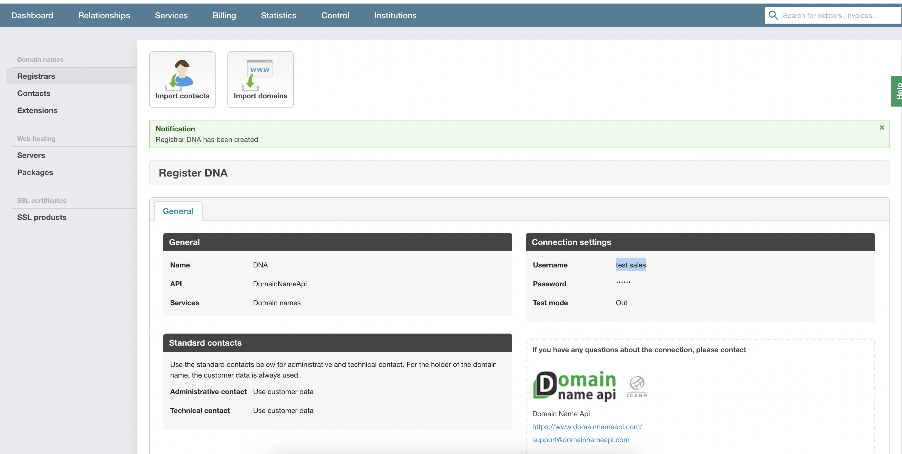
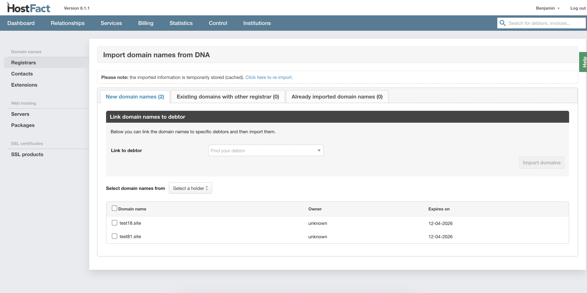
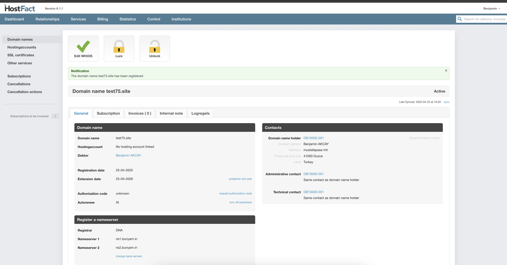

  
  <a href="README-TR.md"   >   TR </a>  
  <a href="README-EN.md"> | EN </a>  
  <a href="README-DE.md"> | DE </a>  
  <a href="README.md"> | NL </a>  

# DomainNameApi Integrationsdokumentation (DE)

## Installation

1.  Legen Sie den Ordner `domainnameapi` im Verzeichnis `Pro/3rdparty/domain/` ab oder laden Sie ihn per FTP hoch.

## Konfiguration im Control Panel

1.  Navigieren Sie zu `Control -> Services -> Registrare`.

    

2.  Klicken Sie auf die Schaltfläche **"Registrar hinzufügen"**.

    

3.  Wählen Sie **"DomainNameApi"** als API aus.

4.  Geben Sie Ihren Benutzernamen und Ihr Passwort ein.

    

5.  Klicken Sie auf **"Speichern"**.

## Domains importieren

1.  Nach dem Speichern der Registrar-Einstellungen werden Sie zum Bildschirm für den Domain-Import weitergeleitet.
2.  Hier können Sie die gewünschten Domains auswählen und importieren.

    
    

## Verwendung

1.  Nach der Konfiguration und dem Import können Sie Produkte erstellen sowie Domains über die DomainNameApi-Integration registrieren und verwalten.

     