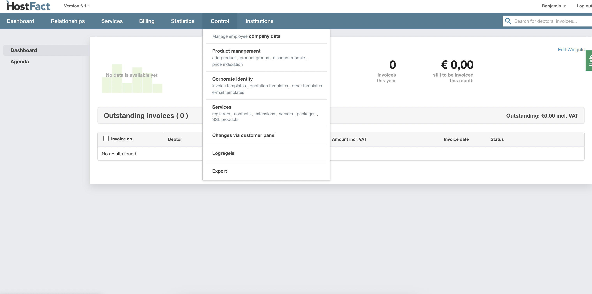
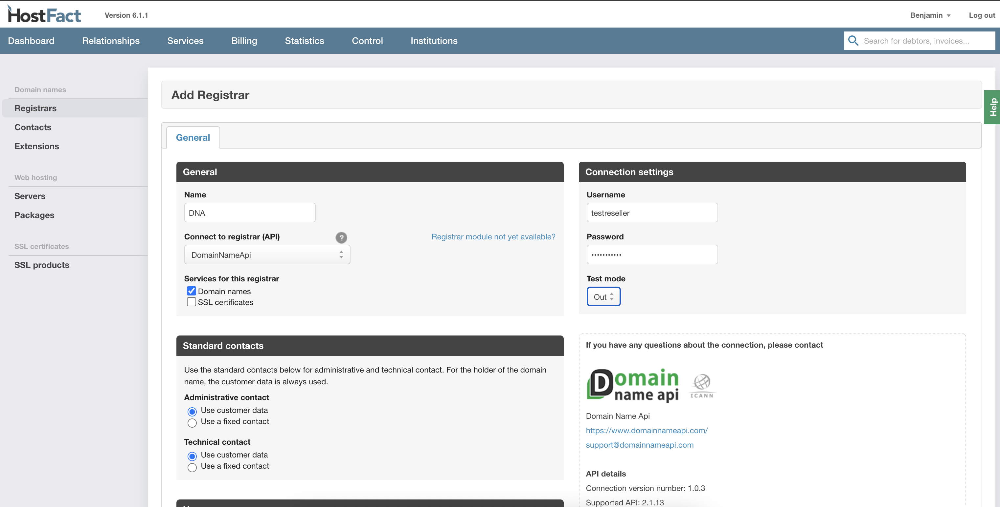
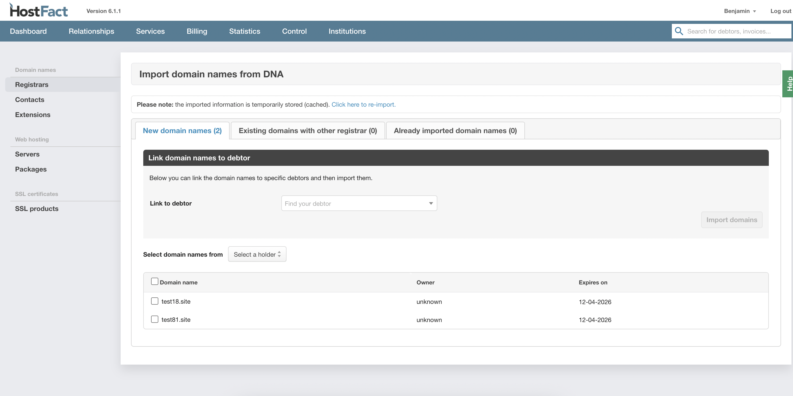

  
  <a href="README-TR.md"   >   TR </a>  
  <a href="README-EN.md"> | EN </a>  
  <a href="README-DE.md"> | DE </a>  
  <a href="README.md"> | NL </a>  

# DomainNameApi Integration Documentation (EN)

## Installation

1.  Place the `domainnameapi` folder into the `Pro/3rdparty/domain/` directory, or upload it via FTP.

## Configuration in the Control Panel

1.  Navigate to `Control -> Services -> Registrars`.

    

2.  Click the **"Add Registrar"** button.

    

3.  Select **"DomainNameApi"** as the API.

4.  Enter your username and password.

    

5.  Click **"Save"**.

## Importing Domains

1.  After saving the registrar settings, you will be redirected to the domain import screen.
2.  Here you can select and import the desired domains.

    
    

## Usage

1.  After configuration and import, you can create products and register and manage domains through the DomainNameApi integration.

     