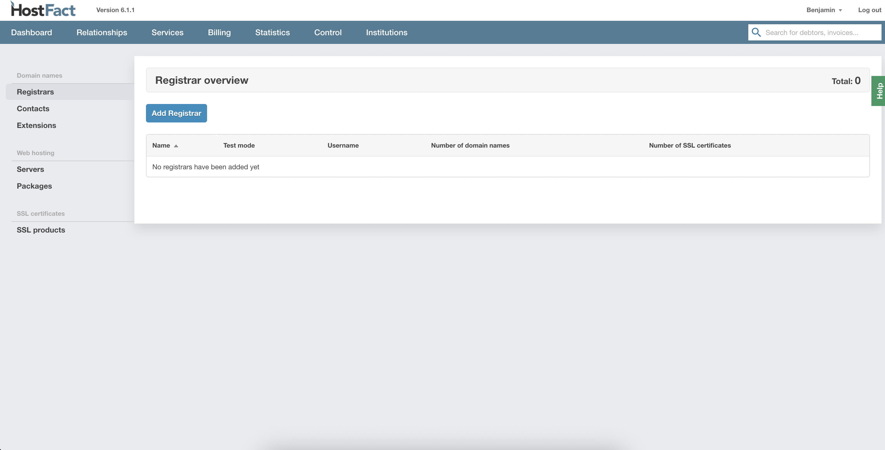
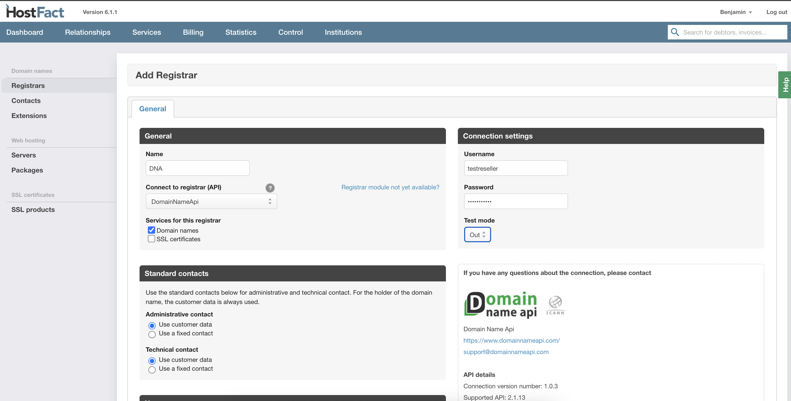
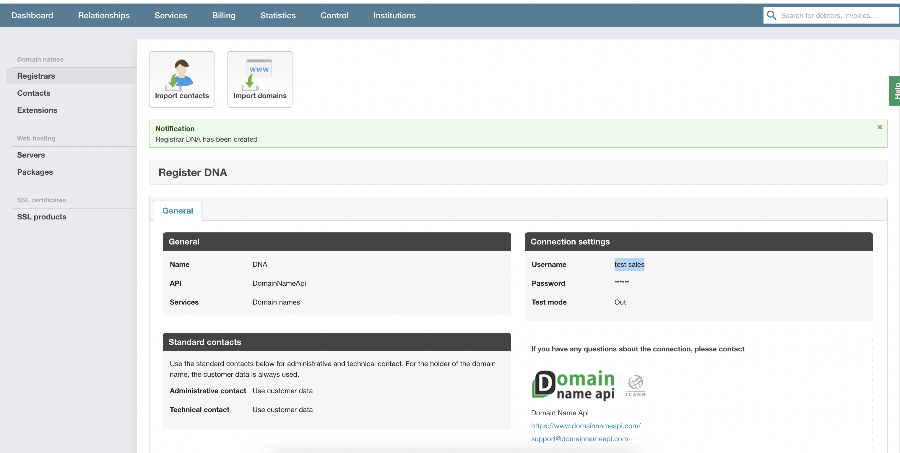
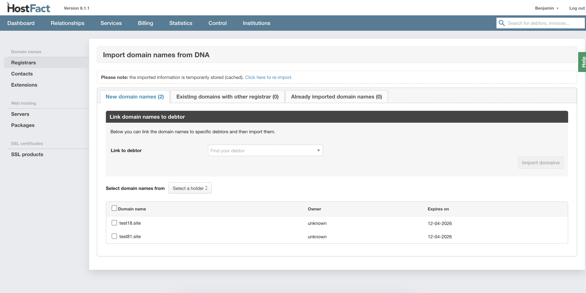
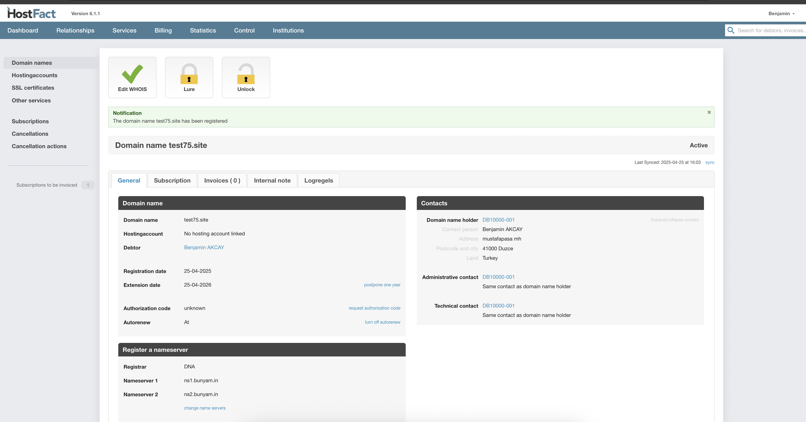

  
  <a href="README-TR.md"   >   TR </a>  
  <a href="README-EN.md"> | EN </a>  
  <a href="README-DE.md"> | DE </a>  
  <a href="README.md"> | NL </a>  

# DomainNameApi Entegrasyon Dokümantasyonu (TR)

## Kurulum

1.  `domainnameapi` klasörünü `Pro/3rdparty/domain/` dizinine yerleştirin veya FTP ile yükleyin.

## Kontrol Panelinde Yapılandırma

1.  `Kontrol -> Servisler -> Kayıt Operatörleri` bölümüne gidin.

    

2.  **"Kayıt Operatörü Ekle"** düğmesine tıklayın.

    

3.  API olarak **"DomainNameApi"** seçeneğini seçin.

4.  Kullanıcı adınızı ve şifrenizi girin.

    

5.  **"Kaydet"** düğmesine tıklayın.

## Alan Adlarını İçe Aktarma

1.  Kayıt operatörü ayarlarını kaydettikten sonra, alan adı içe aktarma ekranına yönlendirileceksiniz.
2.  Burada istediğiniz alan adlarını seçip içe aktarabilirsiniz.

    
    

## Kullanım

1.  Yapılandırma ve içe aktarma işleminden sonra, DomainNameApi entegrasyonu aracılığıyla ürünler oluşturabilir, alan adlarını kaydedebilir ve yönetebilirsiniz.

     