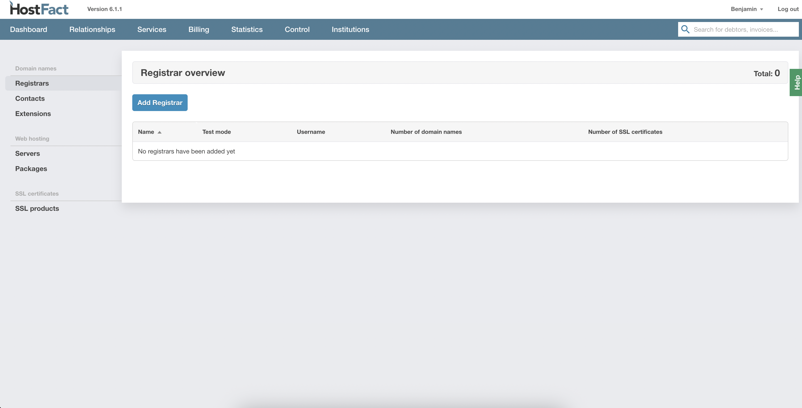

  
  <a href="README-TR.md"   >   TR </a>  
  <a href="README-EN.md"> | EN </a>  
  <a href="README-DE.md"> | DE </a>  
  <a href="README.md"> | NL </a>  

# DomainNameApi Integratie Documentatie (NL)

## Installatie

1.  Plaats de map `domainnameapi` in de map `Pro/3rdparty/domain/`, of upload deze via FTP.

## Configuratie in het Control Panel

1.  Navigeer naar `Control -> Services -> Registrars`.

   

2.  Klik op de knop **"Registrar Toevoegen"**.

    

3.  Selecteer **"DomainNameApi"** als de API.

4.  Voer uw gebruikersnaam en wachtwoord in.

    

5.  Klik op **"Opslaan"**.

## Domeinen Importeren

1.  Na het opslaan van de registrar-instellingen, wordt u doorverwezen naar het scherm voor het importeren van domeinen.
2.  Hier kunt u de gewenste domeinen selecteren en importeren.

    
    

## Gebruik

1.  Na de configuratie en import kunt u producten aanmaken en domeinen registreren en beheren via de DomainNameApi integratie.

    
